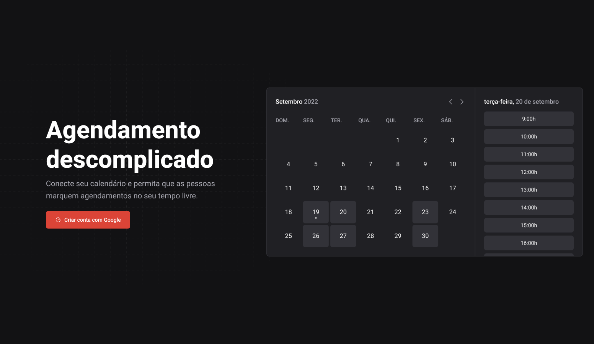
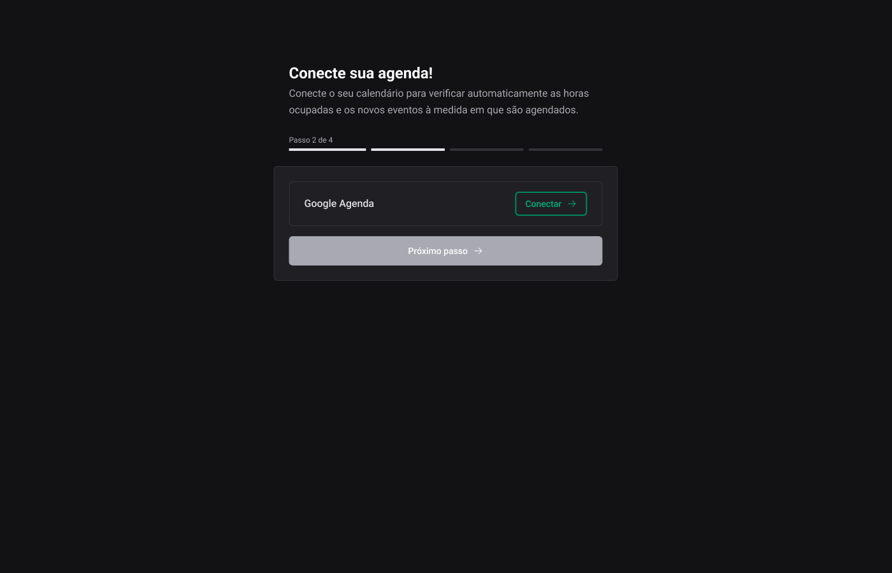
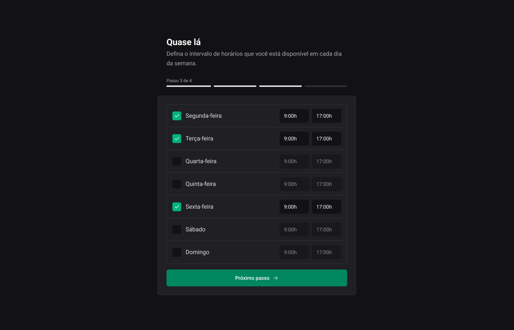
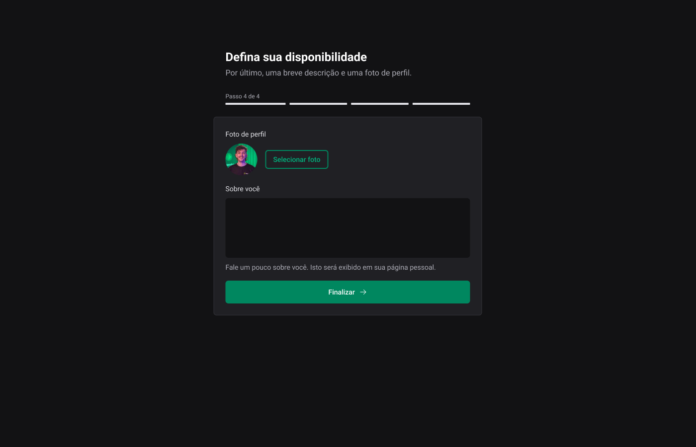
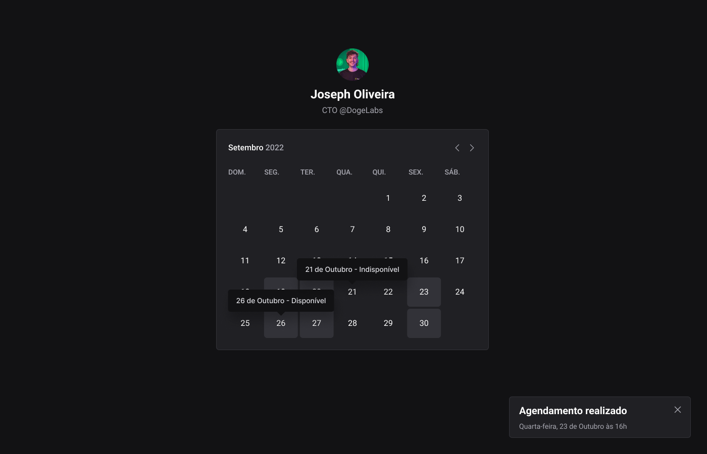
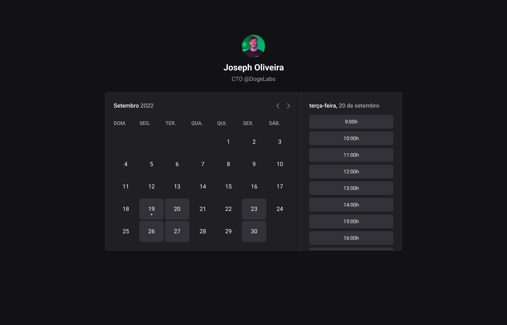
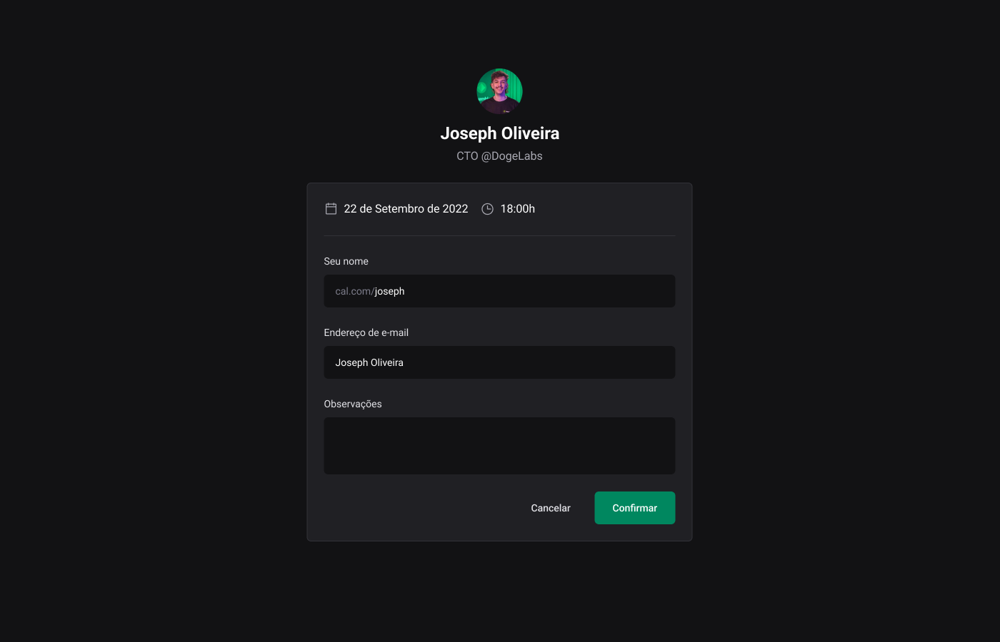

<h1 align="center"> Ignite Call </h1>

 

  

  

  

  

  

  

  

  

## 🚀 Tecnologias

Esse projeto está sendo desenvolvido com as seguintes tecnologias:

- Next.js
- HTML
- Git e Github
- Figma
- Nodejs
- CSS
- JavaScript
- React
- Typescript
- SQL

## 💻 Projeto

Utilizando Design System, é uma aplicação completa até o deploy onde terá rotas autenticadas no next.js, integração com Google Calendar, validações e muito mais.